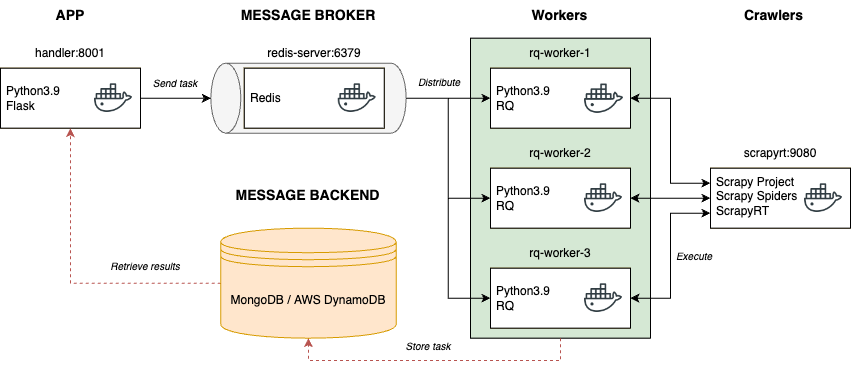

# Scrapyq

### Project goal:

Containerized, distributed asyc request handling daemon for scrapy spiders. This project combines `scrapyrt` with `redis` and aims to add periodic scheduling to scraping tasks.

1. Expose `scrapy` project to an endpoint using `scrapyrt` -  Complete
2. Create an external handler to handle scraping requests -  Complete
3. Queue async requests using `redis` and `rq` -  Complete
4. Replace `rq` with `celery` -  Pending
5. Add `mongodb` backend to dump outputs -  Pending
6. Add scheduler using `celery` -  Pending

### Architecture diagram:


### Stack: 
`docker`, `python3.9`, `scrapy`, `scrapyrt`, `flask`, `redis`, `rq`


### To build and run docker containers:
```
cd scrapyq
docker-compose build --no-cache
docker-compose up
```

Add your custom scrapy spiders to `scrapyq/project/project/spiders/` similar to `example.py`.

To test API, import the POSTMAN collection `utils/scrapyq.postman_collection.json`

**1. Start scraping:** 

```
http://127.0.0.1:8001/start?spider_name=example&url=https://www.example.com/

> Task queued 550de549-600f-4a9a-ae4d-4da15382d8c9, 0 number of tasks left in queue
```
Run this request multiple times via POSTMAN to queue requests in redis. 

Change the spider_name and url for custom spiders and different targets.

**2. Fetch status/result:**

```
http://127.0.0.1:8001/result?job_id=550de549-600f-4a9a-ae4d-4da15382d8c9

> [{'header': 'Example Domain', 'paragraphs': 'This domain is for use in illustrative examples in documents. You may use
this\n domain in literature without prior coordination or asking for permission.'}])
```
Replace the job_id with the ones that are recieved from the first API call(s).
